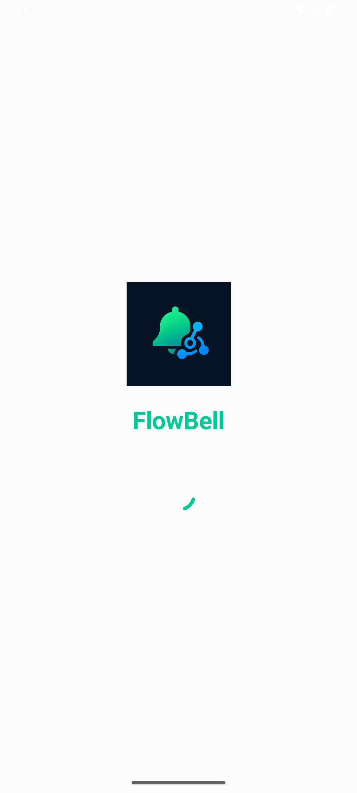
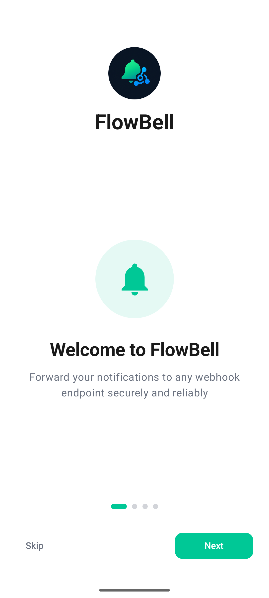
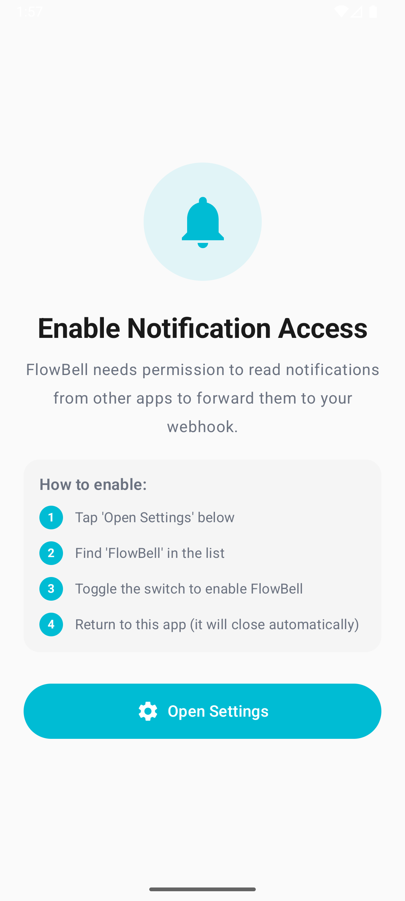
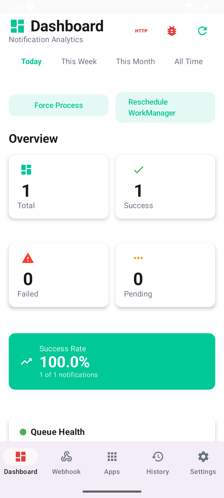
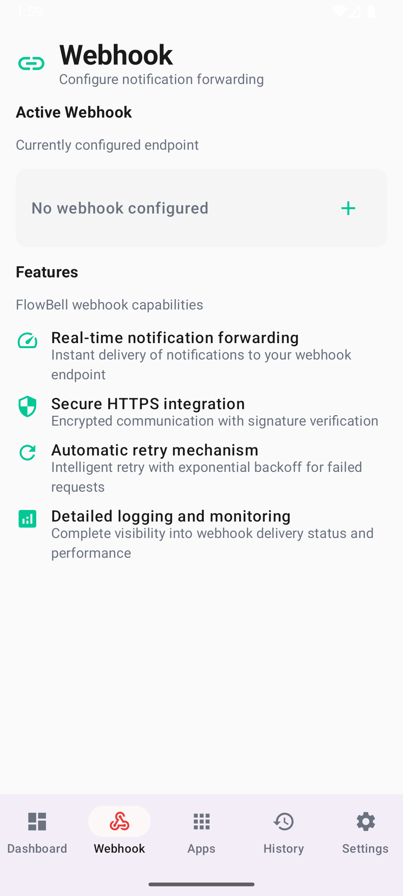
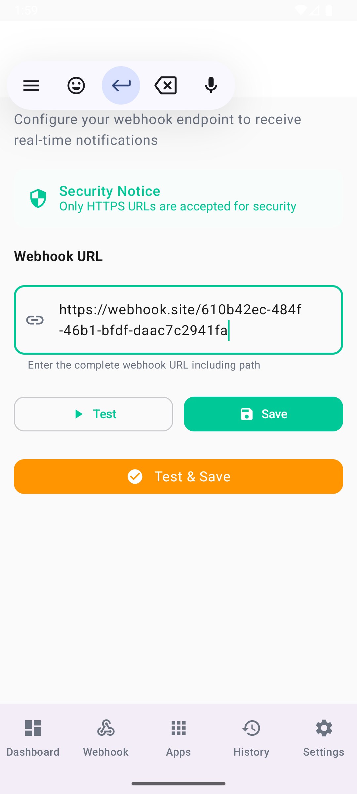
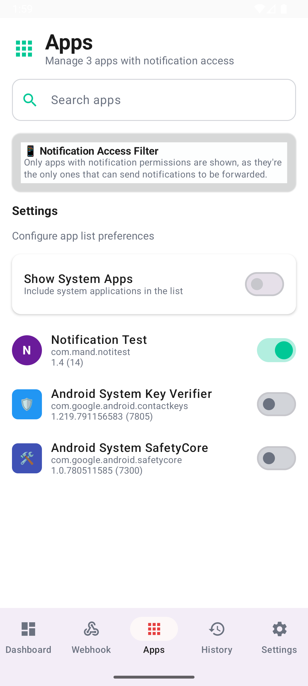
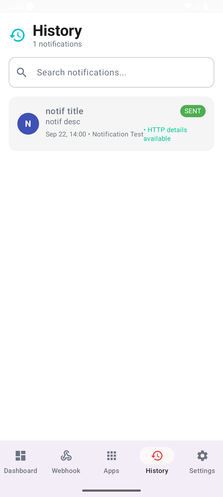
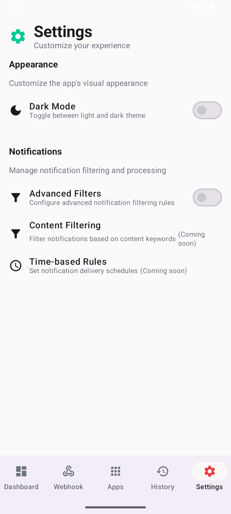

# FlowBell


<div align="center">
  
  <p><em>Single-activity Jetpack Compose app that listens to notifications and forwards them to your webhook in near real time.</em></p>
</div>

## 📋 Table of Contents

<!-- TABLE OF CONTENTS START -->
- [FlowBell](#flowbell)
  - [📋 Table of Contents](#-table-of-contents)
  - [🧐 About The Project](#-about-the-project)
    - [Why FlowBell?](#why-flowbell)
    - [Who Is It For?](#who-is-it-for)
  - [✨ Feature Highlights](#-feature-highlights)
  - [📸 Screenshots](#-screenshots)
  - [🏗️ Architecture](#️-architecture)
    - [Data Flow in Brief](#data-flow-in-brief)
  - [🛠️ Tech Stack](#️-tech-stack)
  - [🚀 Getting Started](#-getting-started)
    - [Prerequisites](#prerequisites)
    - [Installation](#installation)
    - [Run the App](#run-the-app)
  - [📖 Usage Guide](#-usage-guide)
    - [Webhook Payload](#webhook-payload)
  - [⚠️ Use With Caution](#️-use-with-caution)
  - [🗺️ Roadmap](#️-roadmap)
  - [🛠️ Automation](#️-automation)
  - [🤝 Contributing](#-contributing)
  - [📄 License](#-license)
  - [📞 Contact](#-contact)
  - [🙏 Acknowledgments](#-acknowledgments)
<!-- TABLE OF CONTENTS END -->

## 🧐 About The Project

FlowBell turns your Android phone into a notification bridge that you control. A `NotificationListenerService` watches the apps you pick, bundles new notifications every few seconds, and sends a JSON payload to your webhook. The Compose-based UI shows what was forwarded, what failed, and how the queue is doing, while Koin keeps the wiring tidy and Room takes care of storage.

### Why FlowBell?
- **Replace paid integrations**: Mirror banking, email, or messaging alerts into bots, dashboards, or automations without premium subscriptions.
- **Own the pipeline**: Self-hosted webhook endpoint, encrypted preferences, and a local queue so you are never locked out by a third-party.
- **Operational visibility**: Observe send success, failures, retry counts, and the most recent activity directly from the dashboard.
- **Developer tooling first**: Chucker, Beagle, Timber, and structured logs keep debugging fast during development and QA.

### Who Is It For?
- Automation builders who need webhook-friendly notification events for tools like n8n, Activepieces, Zapier, or custom workflows.
- Merchants who receive on-device payment confirmations (for example QRIS apps) and need to forward them to downstream systems instantly.
- Android developers who want a Compose + Koin + Room codebase they can explore and extend.

## ✨ Feature Highlights

- 🔔 **Notification capture** – Listens through `NotificationListenerService`, keeps a short dedupe cache, and only forwards alerts from the apps you enabled.
- 📡 **Batch delivery** – Groups outgoing requests every five seconds by default; falls back to per-item sends when needed.
- 🧠 **Queue history** – Stores every attempt in Room with HTTP status, latency, retry count, and the payload context so you can review it later.
- ⚙️ **Per-app control** – Compose list with search and system-app filtering makes it easy to toggle forwarding on or off.
- 🧩 **Webhook helper** – Built-in tester (OkHttp + Chucker) checks DNS, TLS, and response codes before you save a URL.
- 🔒 **On-device storage** – Webhook preferences, theme settings, and history stay in Room; hooks for `DataStore` or encryption are ready if you want to harden it further.
- 📊 **Dashboards & analytics** – Dashboard surfaces totals and recent activity today; analytics screen is wired for deeper charts as the repositories grow.
- 🔋 **Battery hints** – Utility suggests batch size and cadence tweaks based on power saver, charging state, and battery level.
- 🛡️ **Debug tooling** – Beagle debug menu, Timber, and Crashlytics helpers are available when you need to troubleshoot.

## 📸 Screenshots

| Splash | Onboarding | Permission Prompt |
| --- | --- | --- |
|  |  |  |
| Dashboard | Webhook | Webhook Editor |
|  |  |  |
| App List | Notification History | Settings |
|  |  |  |

## 🏗️ Architecture

FlowBell stays in a single Gradle module but still keeps responsibilities separated into `presentation`, `domain`, and `data` packages.

- **Presentation** – Compose screens (`Dashboard`, `Webhook`, `Apps`, `History`, `Settings`, `Permission`) use MVVM and `StateFlow`. Navigation is handled through a single `MainActivity` with `navigation-compose`.
- **Domain** – Plain Kotlin data classes (`NotificationLog`, `Webhook`, `UserPreferences`, `App`) and repository interfaces so the UI and services can stay testable.
- **Data** – Room (`FlowBellDatabase`) stores queues and preferences, repositories wrap the DAOs, and helpers such as `NotificationListenerService`, `HttpRequestUtils`, and the battery utility live here.
- **App startup** – A custom `Application` kicks off Koin, Timber, Crashlytics hooks, and WorkManager scaffolding.

### Data Flow in Brief

1. A notification comes in → `NotificationListenerService` captures it, enriches the metadata, and discards duplicates.
2. The batch job wakes up → every few seconds the pending queue is drained and `HttpRequestUtils` posts to the webhook.
3. Results are written → success or failure (including HTTP details) is saved back into Room through the queue repository.
4. Screens update → ViewModels collect repository flows and render the dashboard, history, and analytics views.

## 🛠️ Tech Stack

- **Language & UI** – Kotlin 2.1.0 with Jetpack Compose (Material 3, Navigation, SplashScreen). Lottie is ready for richer motion work.
- **Architecture & DI** – MVVM with Koin 3.5 so every screen/view model stays constructor-injected.
- **Persistence** – Room 2.6 for queue/history plus app and user preferences; `DataStoreManager` is available for more granular settings later.
- **Networking** – OkHttp 4.12, Kotlinx Serialization 1.7, and Chucker for inspecting traffic during development.
- **Background work** – Coroutine-driven batching today with a WorkManager worker scaffold in place for longer running jobs.
- **Observability** – Timber for logs, optional Crashlytics, and Beagle for in-app debugging tools.
- **Build tooling** – Gradle Kotlin DSL, AGP 8.8, Kotlin JVM target 21, targeting Android 26–35.

## 🚀 Getting Started

### Prerequisites

- Android Studio Ladybug or newer with Arctic Fox+ Compose tooling.
- JDK 21 (bundled with latest Android Studio).
- Android device or emulator running Android 8.0 (API 26) or higher.
- A webhook endpoint you control (Zapier, Make/Integromat, Cloudflare Workers, custom server, etc.).

### Installation

1. **Clone the repo**
   ```bash
   git clone https://github.com/fathiraz/flowbell.git
   cd flowbell
   ```
2. **Open in Android Studio** – Use *File ▸ Open…* and select the project root. Let Gradle sync finish.
3. **Configure Firebase (optional)** – `google-services.json` is checked in for Crashlytics; replace with your own project if you plan to ship.

### Run the App

1. Select the `app` run configuration and click **Run** (or use `Shift+F10`).
2. Install on a device/emulator with Play Services for full Crashlytics support.
3. On first launch you will be guided through onboarding and asked to grant Notification Listener access.

> ℹ️ The `PermissionRoute` composable is scaffolded. If you land there while completing onboarding, use the Settings shortcut to grant access and then navigate back manually.

## 📖 Usage Guide

1. **Grant notification access** – When prompted, Android will jump to *Settings ▸ Notification access*. Enable FlowBell and head back to the app.
2. **Configure the webhook** – In the Webhook tab, paste your HTTPS URL. Hit **Test** to confirm DNS and TLS before you save; the result shows latency, status code, and response snippet.
3. **Pick the apps** – The Apps tab lists everything installed. Toggle the ones you trust, search by name, or reveal system apps if you need them.
4. **Watch the dashboard** – Totals and recent activity update as notifications move through the queue. Shortcuts to Chucker and Beagle are there if you need deeper debugging.
5. **Review history** – The History tab streams entries as they arrive. Filter by status or app to track down failures, and use the existing scaffolding for detail views or retries.

### Webhook Payload

Payloads use UUID identifiers, include device metadata, and mirror the structure used in FlowBell tests:

```json
{
  "id": "e27fe565-51b4-48f8-92ef-f4c4d33580c8",
  "timestamp": "2025-09-24T01:28:58.039Z",
  "app": {
    "packageName": "com.jago.digitalBanking",
    "name": "Jago",
    "version": "unknown"
  },
  "notification": {
    "title": "",
    "text": "You've received Rp126.000 from PT BUZZER INDONESIA. Need help? Contact Tanya Jago at 1500 746.",
    "subText": null,
    "priority": "normal",
    "isOngoing": false,
    "isClearable": true,
    "category": null
  },
  "media": {
    "iconUri": "icon://2131623940",
    "largeIconUri": null,
    "iconBase64": null,
    "largeIconBase64": null
  },
  "device": {
    "id": "google/sdk_gphone64_arm64/emu64a:16/BE2A.250530.026.D1/13818094:user/release-keys",
    "platform": "android",
    "version": "16",
    "model": "sdk_gphone64_arm64",
    "manufacturer": "Google"
  },
  "security": {
    "signature": null,
    "nonce": "8fbd0c9b7f7e4972b5c0d4e2cf33b0ea",
    "algorithm": "HMAC-SHA256"
  }
}
```

## ⚠️ Use With Caution

- Granting notification-listener access lets FlowBell read every notification on the device. The app still filters by the allowlist you manage in the Apps screen, but the raw access is there.
- Everything is stored locally in Room. We do not ship notifications to any third-party service—only your webhook sees the data you choose to send.

## 🗺️ Roadmap

- [x] Manage webhook URLs end-to-end (validate, save, clear).
- [x] Let people toggle forwarding per app.
- [x] Keep a webhook history with HTTP response details.
- [x] Surface counts for sent, failed, and pending notifications.
- [x] Run batch processing through WorkManager so bursts don’t overwhelm the device.
- [x] Support dark theme out of the box.
- [x] Walk new users through onboarding and ship a splash screen.
- [x] Bundle Chucker, Beagle, and Timber so debugging stays close at hand.
- [x] Add pull-to-refresh on dashboard, app list, and history screens.
- [ ] Explore multi-webhook routing.
- [ ] Allow custom payload templates.
- [x] Add a switch to show or hide debug tooling in production builds.
- [x] Filter words in notifications.
- [x] Filter words per app in notifications.

## 🛠️ Automation

- GitHub Actions builds a clean release APK whenever a GitHub Release is published and attaches it to the release page.
- release-please opens choreographed PRs to bump `versionName`, collect changelog entries, and tag releases automatically once merged.
- Both workflows live under `.github/workflows/` and run on `main` without manual intervention.

## 🤝 Contributing

1. Fork the repository and create a feature branch (`git checkout -b feature/awesome`).
2. Make your changes, keep functions small (<40 LOC), and add or update tests.
3. Open a pull request with context, screenshots (if UI), and testing notes.

Issues, feature ideas, and bug reports are welcome via GitHub Issues.

## 📄 License

There isn’t an open-source license yet, so please treat the code as all rights reserved until a `LICENSE` file appears.

## 📞 Contact

Maintainer – [@fathiraz](https://github.com/fathiraz)

Project Link – [https://github.com/fathiraz/flowbell](https://github.com/fathiraz/flowbell)

## 🙏 Acknowledgments

- [Best-README-Template](https://github.com/othneildrew/Best-README-Template) for the structural inspiration.
- Jetpack Compose, Koin, and Room maintainers for the foundations we build on.
- Everyone in the automation community sharing webhook ideas and tooling.
- Chucker & Beagle maintainers for world-class developer diagnostics.
